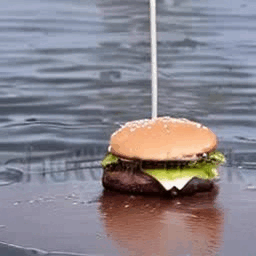

# Investigating the Effectiveness of Cross Attention to Unlock Zero-Shot Editing of Text-to-Video Diffusion Models
<section class="features">
    <figure style="display: inline-block; text-align: center;">
        
      <figcaption><Original Video</figcaption>
    </figure>
    <figure style="display: inline-block; text-align: center;">
       
      <figcaption>Target Attention</figcaption>
    </figure>   
    <figure style="display: inline-block; text-align: center;">
       
      <figcaption>Edited Video</figcaption>
    </figure>
</section>

## Abstract
 With recent advances in image and video diffusion models for content creation, a plethora of techniques have been proposed for customizing their generated content. 
In particular, manipulating the cross-attention layers of Text-to-Image (T2I) diffusion models has shown great promise in controlling the shape and location of objects in the scene. Transferring image-editing techniques to the video domain, however, is extremely challenging as object motion and temporal consistency are difficult to capture accurately. In this work, we take a first look at the role of cross-attention in Text-to-Video (T2V) diffusion models for zero-shot video editing. While one-shot models have shown potential in controlling motion and camera movement, we demonstrate zero-shot control over object shape, position and movement in T2V models. We show that despite the limitations of current T2V models, cross-attention guidance can be a promising approach for editing videos.
