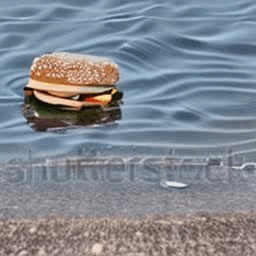

# Investigating the Effectiveness of Cross Attention to Unlock Zero-Shot Editing of Text-to-Video Diffusion Models

  <figure style="display: inline-block; text-align: center;">
    
    <figcaption>Caption 1</figcaption>
  </figure>

  <figure style="display: inline-block; text-align: center;">
    
    <figcaption>Caption 2</figcaption>
  </figure>

  <figure style="display: inline-block; text-align: center;">
    
    <figcaption>Caption 3</figcaption>
  </figure>

